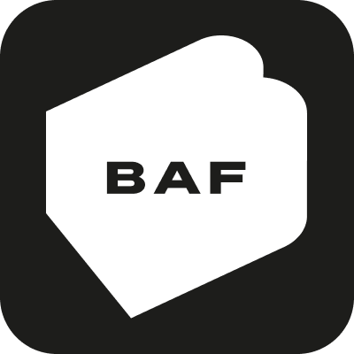

  <strong>Books About Food</strong>

  Beautifully designed cookbooks and the people making them. 
  <a href="https://booksaboutfood.info"><strong>Learn more »</strong></a>

  
  

### Built With

- [Next.js](https://nextjs.org/)
- [React.js](https://reactjs.org/)
- [Tailwind CSS](https://tailwindcss.com/)
- [Payload CMS](https://payloadcms.com/)
- [Inngest](https://inngest.com/)
- [React Email](https://react.email/)

## Getting Started

To get a local copy up and running, please follow these simple steps.

### Prerequisites

- Node.js (Version: >=20.x)
- PostgreSQL
- NPM

### Setup

1. Copy `.env.example` to `.env` and fill in the missing values.

2. Run `npm run dev` to start the development server.

### Development

- **Frontend** → [`http://localhost:5000`](http://localhost:5000)
- **Admin Panel** → [`http://localhost:5000/admin`](http://localhost:5000/admin)
- **Inngest dev server** → [`http://localhost:8288`](http://localhost:8288)

### End To End Tests

The end to end tests in `e2e/tests` are run on merge to main against a production preview deployment. These require a production-equivalent environment to pass.

Run `npx playwright install chromium` to download a test browser.

## Deployment

The application is deployed to Vercel.
