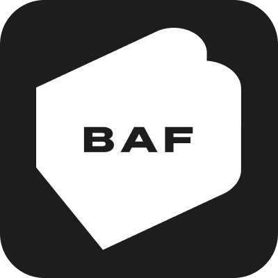

  <strong>Books About Food</strong>

  The cookbook industry's new digital home. 
  <a href="https://booksaboutfood.info"><strong>Learn more »</strong></a>

  
  

### Built With

- [Next.js](https://nextjs.org/)
- [React.js](https://reactjs.org/)
- [Tailwind CSS](https://tailwindcss.com/)
- [Prisma.io](https://prisma.io/)
- [Inngest](https://inngest.com/)
- [Mailing.run](https://www.mailing.run/)

## Getting Started

To get a local copy up and running, please follow these simple steps.

### Prerequisites

- Node.js (Version: >=20.x)
- PostgreSQL
- NPM

> BAF relies on `npm workspaces` to manage multiple components simultaneously, it's untested with yarn or pnpm.

### Setup

1. You'll need environment variables set up for each package. Each package that needs a `.env` file locally has a `.env.example` file checked in, on unix systems you can find them with `find . -name ".env*"`. Copy these and fill in the missing values.

2. Run `npm run dev` to run the local development servers for _all_ relevant packages.

### Packages:

|                      | Directory                                 | Description                                                                          |
| -------------------- | ----------------------------------------- | ------------------------------------------------------------------------------------ |
| **Next.js Frontend** | [/web](`web`)                             | A user facing frontend app built with Next.js                                        |
| **Admin Backend**    | [/admin](`admin`)                         | A server connecting to Forest with customisations. Also acting as server for Inngest |
| **Core Services**    | [/packages/core](`packages/core`)         | A set of shared services, with consistent APIs, for performing business logic.       |
| **Database**         | [/packages/database](`packages/database`) | Prisma schema and client instantiation                                               |
| **End to End tests** | [/packages/e2e](`packages/e2e`)           |  a set of black-box e2e specs for testing critical flows                             |
| **Email**            | [/packages/email](`packages/email`)       | Email templates using MJML and Mailing, including a development preview server       |
| **Jobs**             | [/packages/jobs](`packages/jobs`)         | A set of asynchronous background jobs, run as functions using Inngest                |

### Development Apps

1. **Frontend → [`http://localhost:5000`](http://localhost:5000)**
2. **Admin Backend\* → [`http://localhost:5001`](http://localhost:5001)**
3. **Email preview → [`http://localhost:3883`](http://localhost:3883)**
4. **Inngest dev server → [`http://localhost:8288`](http://localhost:8288)**

<em>\*(N.B. this is not designed to be accessed in the browser, only via Forest, Inngest or API call)</em>

### End To End Tests

Right now, the end to end tests in the `smoke-test` project are run on merge to main against a production preview deployment. These require a production-equivalent environment to pass.

Run `npx playwright install chromium` to download a test browser.

## Deployment

The web frontend for booksaboutfood.info is deployed to Vercel, but can be deployed to any Node server.

The admin backend server for Forest requires a long running Node process, so is more suitable for a platform like Heroku, Digital Ocean, etc.
